# Client Task Management System

A full-stack web application for managing clients, projects/services, and team tasks with role-based access control.

## Features

### Authentication

- User registration
- User login
- User logout
- Protected routes using JWT authentication

### Roles

#### Admin

- Create, edit, delete clients
- Create, edit, delete projects
- Create, edit, delete tasks
- Assign tasks to users
- View all tasks
- Update task status
- View dashboard statistics

#### Employee

- View only assigned tasks
- Update assigned task status
- Add task comments
- View personal dashboard statistics

### Client Management

- Add client
- Edit client
- Delete client
- View client list
- View client details
- Paginated client listing

### Project Management

- Create project under a client
- Edit project
- Delete project
- View project list
- Track status and due dates

### Task Management

- Create tasks under projects
- Assign tasks to employees
- Update task status
- Add task comments
- Filter by status, priority, assigned user, and due date
- Search by task title
- Paginated task listing

### Dashboard

- Total clients
- Total projects
- Total tasks
- Pending tasks
- Completed tasks
- Overdue tasks

## Tech Stack

### Frontend

- React
- Vite
- Tailwind CSS
- React Router
- Axios
- Lucide React
- Sonner

### Backend

- Node.js
- Express.js
- MongoDB
- Mongoose
- JWT
- Zod

## Project Structure

```bash
client-task-management/
  frontend/
  backend/
```

## Setup Instructions

### 1. Clone repository

```bash
git clone <your-github-repo-link>
cd client-task-management
```

### 2. Backend setup

```bash
cd backend
npm install
```

Create a `.env` file in `backend/`:

```env
PORT=5000
MONGO_URI=your_mongodb_connection_string
CLIENT_URL=http://localhost:5173

JWT_ACCESS_SECRET=your_access_secret
JWT_REFRESH_SECRET=your_refresh_secret
JWT_ACCESS_EXPIRES_IN=15m
JWT_REFRESH_EXPIRES_IN=7d

LOG_LEVEL=debug
ENABLE_REQUEST_LOGS=true
ENABLE_RESPONSE_LOGS=true
ENABLE_ERROR_LOGS=true

NODE_ENV=development
```

Start backend:

```bash
npm run dev
```

**Seed Dummy Data**

To populate the database with demo data, run:

```bash
cd backend
npm run seed
```

This creates sample:

- admin user
- employee users
- clients
- projects
- tasks

**Demo Credentials**

Admin:

- Email: admin@example.com
- Password: admin123

Employee:

- Email: rahul@example.com
- Password: employee123

### 3. Frontend setup

```bash
cd ../frontend
npm install
```

Create a `.env` file in `backend/`:

```env
VITE_API_BASE_URL=http://localhost:5000/api/v1
```

Start frontend:

```bash
npm run dev
```

Frontend runs on:

```bash
http://localhost:5173
```

Backend runs on:

```bash
http://localhost:5000
```

## API Modules

- `/api/v1/auth`
- `/api/v1/users`
- `/api/v1/clients`
- `/api/v1/projects`
- `/api/v1/tasks`
- `/api/v1/comments`
- `/api/v1/dashboard`

## Pagination

Pagination is implemented for:

- Clients
- Tasks

## Validation and Security

- JWT-based authentication
- Protected API routes
- Role-based authorization
- Request validation using Zod
- Error handling with proper status codes

## Screenshots

### Login Page

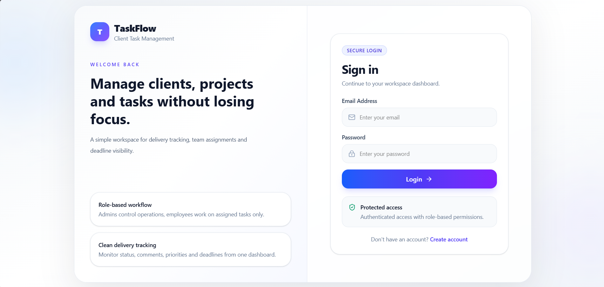

### Register Page

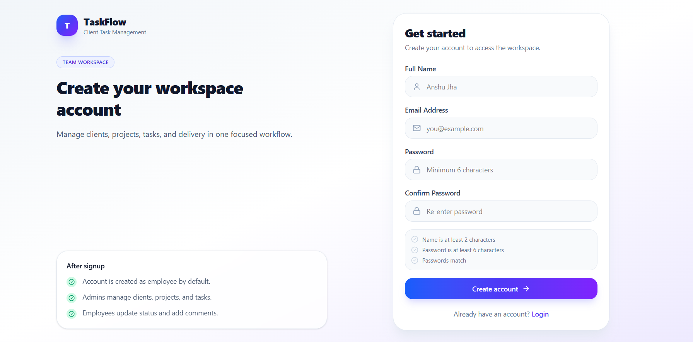

### Admin Dashboard

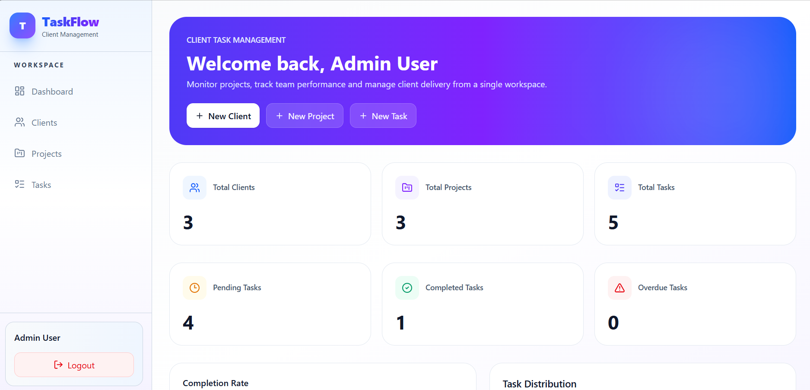

### Clients Page

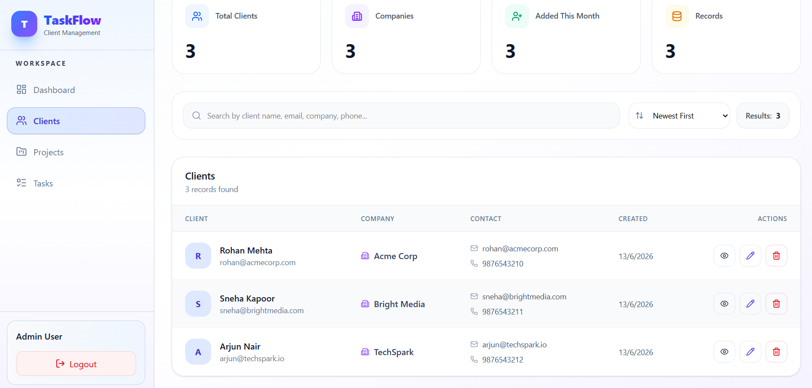

### Add Client Modal

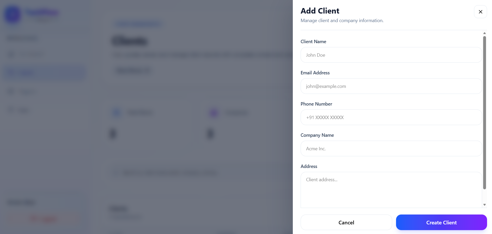

### Projects Page

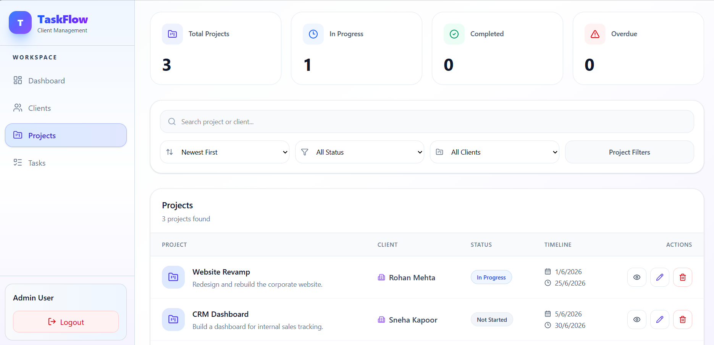

### View Project Modal

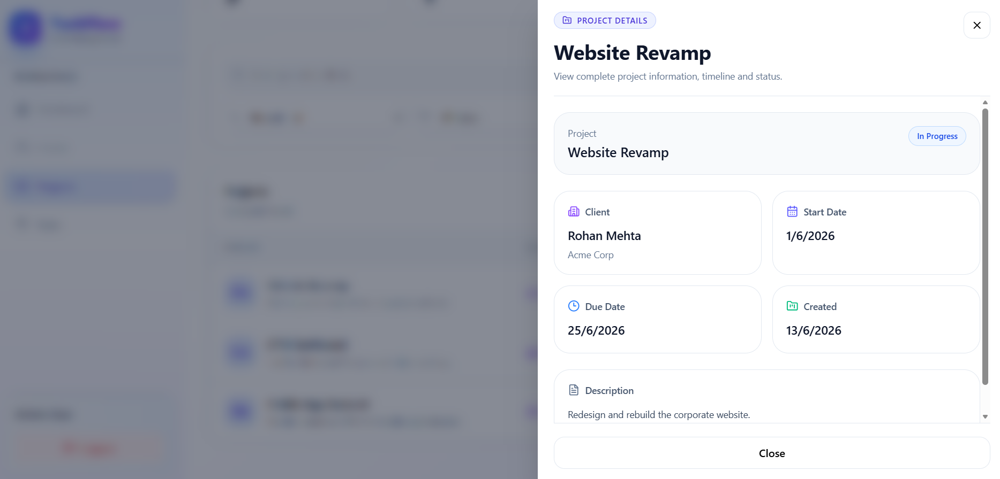

### Tasks Page (Admin)

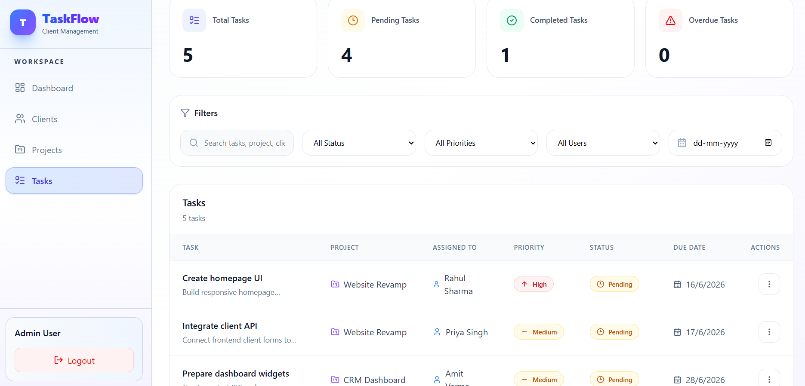

### View Task Modal

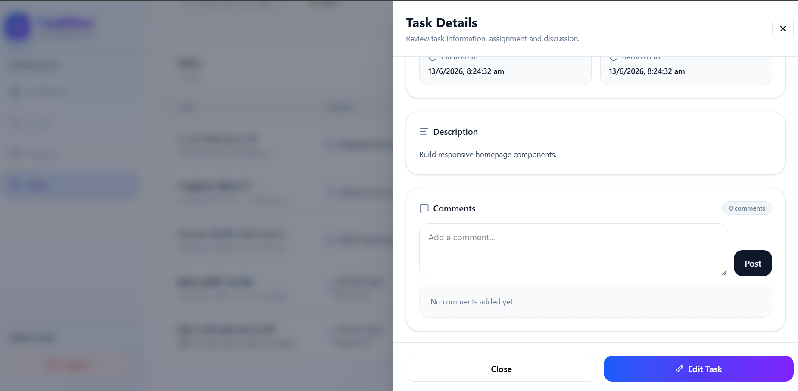

### Employee Dashboard

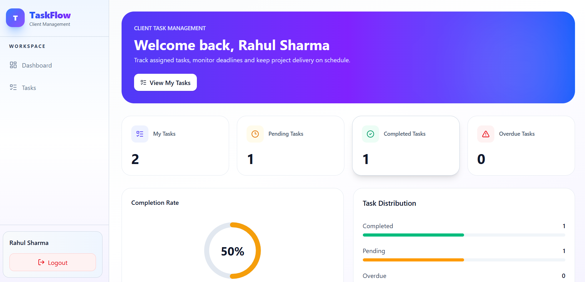

### Employee Tasks Page

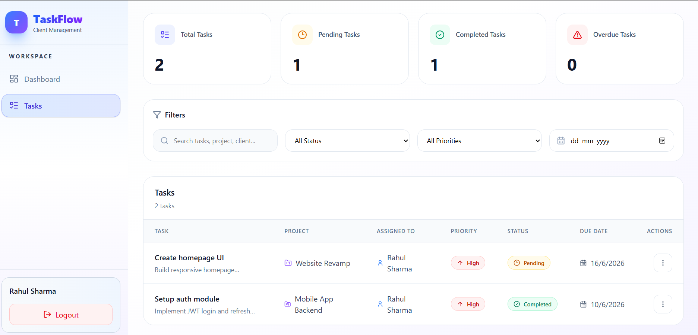

## Future Improvements

- Server-side search and sorting for clients/projects
- Email reminders for overdue tasks
- Notification system
- File attachments on tasks
